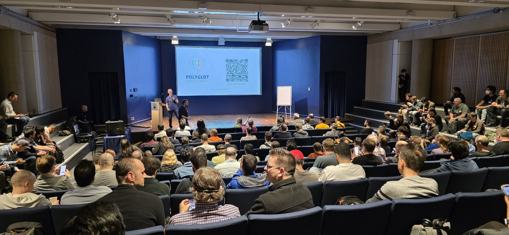
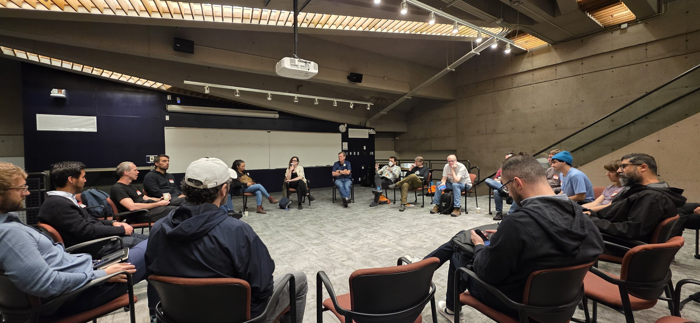
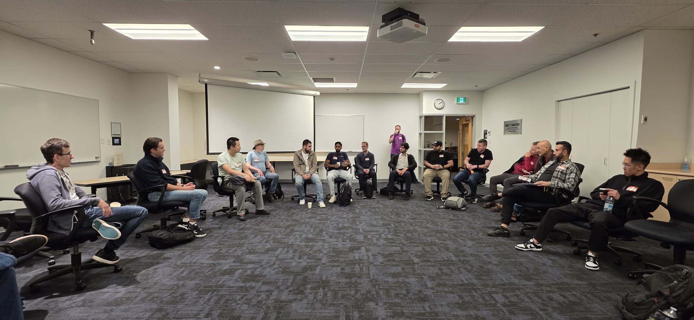
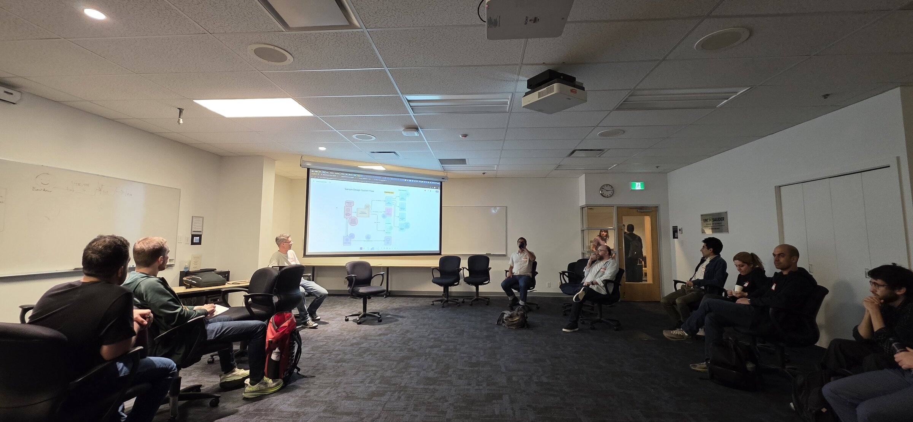
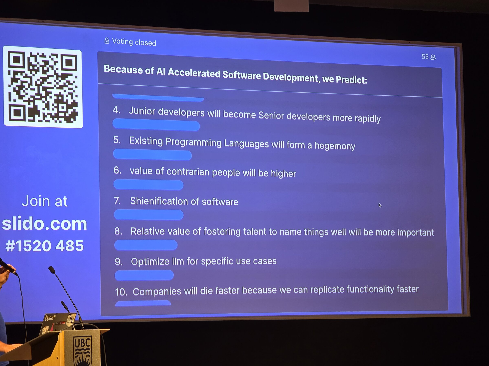

I attended the Polyglot Software Unconference in Vancouver on Saturday, October 11, 2025, at UBC Robson Square. Yes, you
read that right: 2025. This post is indeed late.

Recently I received a message from Tavis Rudd, the unconference organizer, about the upcoming Polyglot Unconference
2026, happening on **Saturday, October 17**. That reminded me that I have notes about this event that I haven't really
shared or posted. I thought they would serve as a useful insight for those who haven't decided about the upcoming event
yet. (If you're a PyLadies Vancouver member, there's a discount code; details are on the
[PyLadies Vancouver blog](https://vancouver.pyladies.com/blog/polyglot-unconference-2026/).) So, here goes.

## Conference vs. unconference

I've been to a lot of conferences in the last ten years, but it had been a long time since my last unconference. The
only other one I can remember was a BarCamp in Saskatoon around 2012, so I was re-learning the difference along with
everyone else.

At a typical conference, the program is set ahead of time. You know the talks and the speakers before you buy a ticket,
and that can be the whole reason you buy one: there's a speaker you want to hear, or a track that justifies the
education budget to your manager.

At an unconference, there is no schedule and no program. There are no "speakers" and "attendees," only "participants."
At the start of the day, anyone can propose a topic, everyone votes, and the most popular sessions get rooms. Maybe your
topic gets chosen; maybe it doesn't. Because you can't know what will be discussed, I can see how it's harder to justify
going, and harder to know what to expect.

In my case, Tavis had offered me a free ticket, and the organizers also shared discount codes for PyLadies Vancouver. A
free conference downtown was not something I was going to pass up.

## How the day worked

A few days before, the organizers shared a live Google Doc with how the event would run, parking, the general schedule,
and afterparty info. Some participants had already written their session ideas into the doc.

The morning opened with introductions and thanks to the sponsors and volunteers, and a reminder that we were all there
to participate, not to attend. They also went over the session formats people could pitch: full group discussion,
pre-prepared talk, panel, workshop, show-and-tell, lightning talks.

Then came the pitches. Anyone with an idea lined up, got on stage, and had two or three minutes to pitch it, while a
volunteer typed each session title into their custom Django app. Once the pitches were done, we all opened the app,
voted, and the winning sessions appeared on a schedule. Sessions were about 45 to 60 minutes each, with four to six
running concurrently, so there was plenty to choose from. As expected, a lot of them were about AI.

I pitched a pre-prepared talk on generating QR codes in Python and running your own URL forwarder, the same talk I'd
given at DjangoCon US 2025.

## Sessions I went to

### Reverse engineering the QR code and URL forwarder service

This was mine. Shortly after voting closed I found out it had been chosen, so I presented how to generate your own QR
codes in Python, why I don't like third-party QR services (ads and tracking), and my own free generator site, which also
hosts a URL forwarder so I can change where a printed QR code points. The discussion afterwards was good: how people use
QR codes in general, the differences between the Python QR libraries, and a few ideas for doing the whole thing in the
browser with no backend at all.

Slides: [secretcodes.dev/polyglot-unconf](http://secretcodes.dev/polyglot-unconf)

### Top-down or bottom-up: should software development be led by leaders or by developer teams?

A team-management discussion; many of the people in the room were engineering managers or team leads. Things that came
up:

- _Team Topologies_ as a resource, and later _Flow Engineering_
- An EM who leans bottom-up and wanted to know how to get team members to champion ideas themselves
- What tools people use to surface and align ideas, roadmaps, and goals
- The idea of "social credit" within a team
- Letting people do "gigs" with another team to pick up a skill they don't have, which really only works at larger
  companies with many teams
- Whether hackathons work; results were mixed. One company runs a "shark tank of ideas" instead, on the theory that the
  goal isn't to produce code in a weekend but to make space for people to share ideas.

### Crypto: what is it good for?

A facilitated discussion started by someone on the Solana core team, with ground rules: no trading talk, no coins, no
"which one should I buy." Only what people could actually use a blockchain for.

I went because I know very little about crypto and mostly hear bad things about it, so this seemed like a chance to hear
the other side. The room had skeptics (including people who had owned crypto and pulled out on moral grounds), newbies
like me, and a good number of knowledgeable supporters.

The first half was the supporters explaining to the rest of us how it works, mostly by analogy to banking and ticketing.
What I took away is that the benefit is trust in the ledger: parties who don't like or trust each other can all trust
the same public record, because falsifying it would take far more effort than it's worth. The analogy that landed for me
was loyalty points. Starbucks stars can only be spent at Starbucks, and only Starbucks knows who has them. Now imagine
the points lived on a public ledger and could be spent anywhere.

### Design systems: tokens, pipelines, docs, components

I only stayed for the beginning. The title sounded broad, but it turned out to be a Figma workshop about design tokens
and variables, which wasn't what I was after. This is where the rule of two feet earns its keep.

### Second-order effects of vibe-coded everything

The most interactive session of the day. The facilitator gave us a prompt, "Because of AI-accelerated software
development, we predict…", and we finished it on Slido, voted on each other's predictions, and could come on stage to
argue for or against them. Some of the predictions:

- Far more vibe-coded outages
- Companies building more of their own custom tools
- We're in the VC-subsidized phase of AI and prices will go up, like Uber
- Enshittification
- Junior devs becoming senior devs faster
- Existing programming languages forming a hegemony, because that's what the models were trained on
- Contrarian people becoming more valuable
- "Sheinification" of software (I'm still not sure what this one meant)

## Reflection

Going in, I was worried I wouldn't be able to participate: that I wouldn't have anything interesting to discuss, that
nobody would vote for my session, that I wouldn't know anyone and would look awkward, that it would be a wasted
Saturday.

None of that happened. The atmosphere was friendly and energizing. Even though we all program in different languages, we
face the same problems, and it was good to talk about them with people outside my own bubble. A lot of the sessions
weren't language-specific at all; they were about teamwork and leadership. You don't have to be a developer to get
something out of it. I met students, professors, PMs, and engineering managers, and I did meet several Python and
PyLadies friends there too.

It is a different experience from a traditional conference, and I liked that I wasn't passively listening. I got to
discuss, share, and ask.

The flip side is that with no abstracts, an interesting-sounding title can turn into a session you don't want to be in.
That's what the rule of two feet is for: if you're no longer learning or contributing, get up and give the seat to
someone else. Nobody minds. That is the point.

One more thing I'd tell anyone going for the first time: even at an unconference, being prepared pays off. I didn't
dream up a brand-new presentation for Polyglot. I brought a talk I already had, one I'd given a few months earlier at
DjangoCon, and pitched that. If you have an existing talk, bring it and pitch it. You might be surprised that people
actually want to hear it. And if it doesn't get voted in, you've lost nothing; you still get the rest of the day.

I enjoyed it, and I'm going back this year: I've already registered. If you're thinking about it, the
[PyLadies Vancouver post](https://vancouver.pyladies.com/blog/polyglot-unconference-2026/) has the discount code and a
few tips for first-timers.

## Thank you

Last year, Tavis offered me a free ticket as thanks for my contributions to the Vancouver Python community. This year, I
also received a free ticket as a meetup organizer. Thank you Tavis and the Polyglot Unconference for celebrating and
supporting local meetup organizers.
