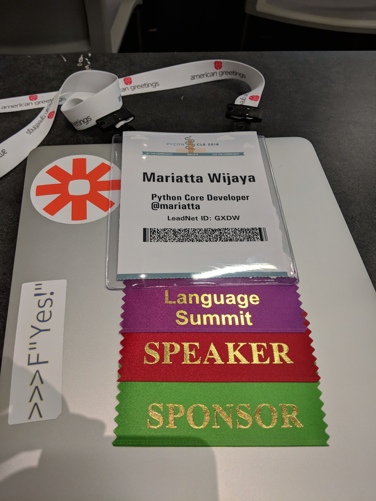

PyCon 2018
##########

:date: 2018-05-19 14:00
:slug: pycon-2018
:category: Python
:tags: Python, conference, PyCon, sprint
:author: Mariatta

I was at PyCon from May 9 - May 15. It's my fourth PyCon US, and has been very
special to me in many ways. (Also my busiest yet!)

Representing Zapier
-------------------

Thanks Zapier for fully supporting my trip to PyCon, and for allowing me to
take the time away from work for more than a week. The significance of this, for
me personally, is that for the first time I didn't need to apply for financial
aid in order to attend PyCon.

With Zapier's support, I was able to stay for two days of sprints. It means
I get to contribute for open source for **two full days**! 😆🌮

Python Language Summit
----------------------

I attended the Python Language Summit for the second year. This time I presented
two topics. I had planned to do a lightning talk too, but by end of the day
I was too exhausted, so no lightning talk from me.

The language summit was open to Python core developers, and by invitation only.
There was no recording, however there will be an article by Jake Edge from LWN.
I presented two talk topics at the language summit. I'll leave you in suspense
as you await the LWN article.

A little side anecdote, when I first became a Python Core Developer last year,
a couple core devs and a BDFL each told me about the language summit. And each
one of them **warned** me of a certain *incident* happened at the language summit in
the past. To protect the identity and the integrity of the folks involved, I won't
say what the incident was.

Throughout the year, I kept hearing of the same incident mentioned by several
other core devs. So I came to think of it as an urban legend.

Anyways...

There might have been two new urban legends born at Python Language
Summit 2018.

Tutorial
--------

I gave a `tutorial <https://youtu.be/ZwvjtCjimiw>`_ at PyCon. I think it went quite well.
I definitely can be a better instructor next time, but I believe the attendees had
fun and learned many new things.

I wanted to thank my friends for coming and helping out at my tutorial. Many attendees
faced technical difficulties, and I would not have been able to attend to them
one by one. Really, it would not have gone as well without their help!

So thank you friends: Jane Williams, Matt Davis, Ned Deily, Victor Stinner,
Stéphane Wirtel, Eric V. Smith, Christian Heimes. You're all the best!
Thanks Carol Willing and Guido van Rossum for dropping by, and special thanks
Brett Cannon for the cameo!

Talks
-----

I gave a talk, `What is a Python Core Developer <https://youtu.be/hhj7eb6TrtI>`_.
Poured my heart out, and felt really good afterwards. Thank you
everyone who came to my talk, (and for the standing ovation 🙇🏻‍♀️).

I only managed to go to a several keynotes and talks:

- `Dan Callahan's Keynote <https://www.youtube.com/watch?v=ITksU31c1WY>`_

- `Brett Cannon's Keynote <https://www.youtube.com/watch?time_continue=2935&v=tzFWz5fiVKU>`_

- `Catherine Devlin's Keynote <https://youtu.be/3kta4GB3PAw>`_

- Anna Ossowski: `Flourishing FLOSS: Making Your Project Successful <https://youtu.be/GmbaKdd6o6A>`_

- Christopher Neugebauer, Josh Simmons, Sam Kitajima-Kimbrel: `How we designed an inclusivity-first conference on a shoestring budget and short timeline <https://youtu.be/C7ZhMnfUKIA>`_

- Ned Batchelder: `Big-O: How Code Slows as Data Grows <https://youtu.be/duvZ-2UK0fc>`_

Sprint
------

I felt quite productive during the sprint days!!

Over the course of two days I made these contributions to open source:

- Created python/miss-islington `PR #88 <https://github.com/python/miss-islington/issues/88>`_:
  Assign the failed PR to be backported to the core dev who merged it

- Reviewed and merged python/core-workflow `PR #238 <https://github.com/python/core-workflow/pull/238>`_:
  Change single quotes to double quotes in get_author_info_from_short_sha to fix error in Windows

- Reviewed and merged python/devguide `PR #363 <https://github.com/python/devguide/pull/363>`_:
  fix: fixed typo in the setup dev guide

- Reviewed and merged python/cpython `PR #6609 <https://github.com/python/cpython/pull/6609>`_:
  bpo-22069: Flush is implied also when write contains a carriage return

- Reviewed python/cpython `PR #142 <https://github.com/python/cpython/pull/142>`_:
  bpo-1025395: Fix email.utils.parseaddr to handle multiple hops

- Reviewed python/cpython `PR #6883 <https://github.com/python/cpython/pull/6883>`_
  bpo-21475: Support the Sitemap extension in robotparser

- Created pycqa/pylint `PR #2091 <https://github.com/PyCQA/pylint/pull/2091>`_:
  Add a new check: `logging-fstring-interpolation`

- Created pycqa/pylint `PR #2092 <https://github.com/PyCQA/pylint/pull/2092>`_:
  Fix weird indentation in contributing guide

- Created python/devguide `PR #362 <https://github.com/python/devguide/pull/362>`_:
  Add link to zulipchat in communications page

- Released `cherry_picker v1.1.1 <https://pypi.org/project/cherry-picker/>`_ to PyPI.

- Discussed the documentation for PEP 557 with Eric V. Smith and Ned Deily.

I slacked off too!

I still found time to chat and gossip with other folks during the sprint days.
Thanks Ned Batchelder, Anna Ossowski, Jeff Triplett, Ernest W. Durbin III, and Guido
van Rossum for being available and lending their ears.

Regret
------

I had wanted to help writing the documentation for PEP 557, the dataclasses module.
In the end I was not able to help with anything. Thank you Eric V. Smith for
writing up the proper documentation. Check it out `here <https://docs.python.org/3.7/library/dataclasses.html>`_.

Eric also gave me a crash course of the dataclasses module. No better way to
learn about it from the creator himself!

Rainbow Roses
-------------

I ordered a dozen rainbow roses to be delivered to my hotel room. They're very
lovely. I think I will make this a new ritual. 🌹💐

One of the roses didn't make it, that's why there are only eleven in the photo. 😛

Poison
------

In total, I had 11 shots of tequila over the period of 7 days. Eric Holscher
started to make a comment about it and James Bond and martini... 🤐
*I'm much less exciting than James Bond!!*

At dinner one evening with Victor and Guido, I didn't see tequila on the menu.
So we ended up with this cute drink that has only 12% alcohol. 😭

Wat?
----

- Dave Beazley included `>>>F"Yes!"` in his `talk slides <https://twitter.com/loooorenanicole/status/995343478015102976>`_.
  I didn't realize that he'd been reading my tweets. 🤭

- The number of people who proudly wore their PyCascades t-shirt at PyCon truly amazed me.
  Thank you!!!
  🙇🏻‍♀️

- All the folks who said hi and told me that they know me by reputation...
  🙇🏻‍♀🙇🏻‍♀🙇🏻‍♀🙇🏻‍♀

Photos
------

Other favorite memories from PyCon 2018.

- The dessert at PyLadies lunch (on Mother's Day).

  .. image:: ../img/pycon2018-pyladieslunch.jpg
      :width: 400

- PyCascades founders, 4 out of 6: Sebastian Vetter, Don Sheu, Eric Holscher, and myself.

  .. image:: ../img/pycon2018-pycascades.jpg
      :width: 400

- Met up with my brother and we ate lots of seafood at
  `Boiling Seafood Crawfish <www.boilingseafoodcrawfishoh.com>`_.

  .. image:: ../img/pycon2018-seafood.jpg
      :width: 400

- I didn't recognized my hero at first (never met him in person until PyCon), but he
  recognized me. 🙈

  .. image:: ../img/pycon2018-hero.jpg
      :width: 400

- Python Language Summit chairs handover/initiation meeting.

  .. image:: ../img/pycon2018-languagesummitchairs.jpg
      :width: 400

- My luggage was searched by the TSA. 🛃 #PyNutella

  .. image:: ../img/pycon2018-pynutella.jpg
      :width: 400

Until next time
---------------

I tried to include as many memories as I can into this post, but I'm unable to include
everything. 😥

I got to chat and met with many many more people: all the Python Core Developers,
Python BDFL, open source project maintainers, PyLadies members, speakers, and various members
of this community. It's been inspiring and I learned a lot from all of you.

PyCon 2018 had been very very busy, intense, special, and lovely. Thank
you organizers, volunteers, sponsors, and all the wonderful Python community for these memories.

🌮