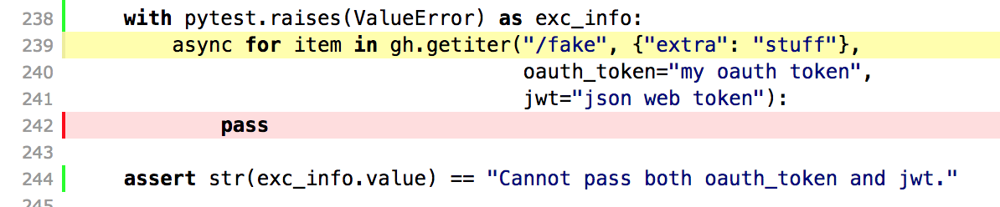

2018
####

:date: 2019-01-01 11:00
:slug: reflections-2018
:author: Mariatta

2018. It was quite a year! Not quite like 2017, but quite remarkable in its own way.

A lot of things happened. Mostly good things. Some bad things, but definitely
it was a net positive year.

Still quite a busy year, but I feel mostly good about it all.

I made some mistakes, but proud of a lot of things.

Starting new at Zapier
======================

My start date at Zapier was about two weeks before PyCascades. Perhaps, I should've waited until after PyCascades wrapped up before starting a
new job. I found myself needing more time to adjust and ramp up to my new work
environment, new team, new responsibilities, new everything. It took longer than
I'd like before I really feel like I'm getting a hang of my new job. I'm grateful
that Zapier has been understanding and accommodating.

PyCascades 2018
===============

We put out PyCascades! It was *great*! It was amazing! I'm really proud of it.
I'm proud of `all of our speakers <https://2018.pycascades.com/schedule/>`_.
I'm proud to have hosted `the creator of Python <https://2018.pycascades.com/talks/bdfl-python-3-retrospective/>`_.
I'm proud that we filled the theatre. I'm proud that our speakers got the audience
they deserve. I'm proud that our community is enriched by the talks we chose.

But the one thing that I'm most proud of, is our organizing team. Who would have
thought that somehow, this team of people with different backgrounds,
coming from different countries, living in different cities, somehow, *we made it work*.
Since day one, the PyCascades team has done nothing but completely support, respect, and trust
one another. I can't ask for a better team.

Seb, Bryan, Eric, Alan, and Don, I feel lucky that somehow you've all included me
into this.

Conferences
===========

Other than PyCascades, I went to three other conferences: PyCon US, DjangoCon, and
North Bay Python. I presented a tutorial and a talk at PyCon US, as well as a couple
talks at Python Language Summit.

I'm real honored to have been invited to as keynote speakers at DjangoCon and
North Bay Python. Both of these communities now have special places in my heart.

I received four other invitations to give keynote at conferences, from faraway places, places
I've never been. But unfortunately I had to decline them. Not because
I didn't want to speak there, but I just couldn't take any more time away from my
family and my work.

Travels
=======

I didn't get to visit many different countries this year, but I visited many new
places in the US. For Zapier-related travels, I visited Hilton Head Island,
Phoenix, and Chattanooga. For Python-related events, I visited Cleveland, Bellevue,
Petaluma, and San Diego. We spent a week in Cancun for spring break. I went on a
solo road trip in the summer. I drove around Oregon and Washington, I went to Mount
Hood and Mount St. Helens.

It me!
======

I was asked for `an interview with Noam Cohen from The New Yorker <https://www.newyorker.com/science/elements/after-years-of-abusive-e-mails-the-creator-of-linux-steps-aside>`_.
I was quite nervous about it initially. I felt kinda silly about it now, but I had
to admit, I didn't know much about The New Yorker, so I had to ask a couple American friends
of its reputation. My excuse was that I'm an immigrant and I don't follow
American media. Anyways, (and I feel lucky to have them as friends because they didn't judge!),
they all said that it is a great opportunity.

I didn't even know why I had to be nervous about it. I guess this is something
I can brag about to my future descendants.

Black_out
=========

I started working on a new side project, `black_out <https://github.com/mariatta/black_out>`_.
It was very much inspired by my experience developing `miss-islington <https://github.com/python/miss-islington>`_.
Black_out is a GitHub bot that runs `black <https://black.readthedocs.io/en/stable/>`_ on pull requests.

I've learned many new things by building black_out.

To make black_out happen, I needed a new feature to be implemented in gidgethub,
that is the ability to be authenticated using JSON web token. Because
I wanted this feature in gidgethub, I ended up `writing the PR <https://github.com/brettcannon/gidgethub/pull/62>`_ myself.
Short story is, this is done, and it's been included since gidgethub 3.0.0.

A little longer story: writing the tests and maintaining 100% coverage
was quite an adventure! There was one part where I just didn't know how to write the test case for.

This was the test that I started writing (see picture).

I needed to come up with a test case for an async generator ``gh.getiter()``, where
``ValueError`` is raised if both ``oauth_token`` and ``jwt`` are passed.

The way I wrote it initially, ``coverage`` reported that there was no coverage there, and
I didn't know what I needed to do about it.

So I contacted the maintainers of ``coverage``, ``asyncio``, and ``pytest`` for advice,
in case they've come across similar situation before.

Ned commented that it seemed odd to use ``pass`` there.

We then experimented doing it as follows:

::

   with pytest.raises(ValueError) as exc_info:
       gh.getiter("/fake", {"extra": "stuff"}, oauth_token="my oauth token", jwt="json web token")

But it resulted in an error: ``Failed: DID NOT RAISE <class 'ValueError'>``.

He then suggested to "just use nocover pragma". Yury suggested using
``pytest.fail`` instead of ``pass``.

The `end result <https://github.com/brettcannon/gidgethub/blob/b260304d3feec022c9890e12b5bdd6bff4c51029/gidgethub/test/test_abc.py#L250-L254>`_ is::

   with pytest.raises(ValueError) as exc_info:
       async for _ in gh.getiter("/fake", {"extra": "stuff"}, oauth_token="my oauth token", jwt="json web token")
           pytest.fail("Unreachable")  # pragma: no cover

New to me!

My First PEP (and second)
=========================

I wrote a PEP for the first time: `PEP 581 <https://www.python.org/dev/peps/pep-0581/>`_ - Using GitHub Issues for CPython. I've
been working on it for some time since earlier this year, but before I got the
chance to announce it, Guido announced his retirement as Python BDFL. I'm happy
for him. His retirement also meant that there was no one who could pronounce
on PEP 581.

I then wrote `PEP 8011 <https://www.python.org/dev/peps/pep-8011/>`_ - Python
Governance Model Lead by Trio of Pythonistas, co-authored
with Barry Warsaw. PEP 8011 was not top choice among core developers, and I'm fine with that.

Other things to be proud of
===========================

I worked on `blurb_it <https://github.com/python/blurb_it>`_, and learned how to
use `aiohttp-jinja2 <https://github.com/aio-libs/aiohttp-jinja2>`_ and `aiohttp-session <https://github.com/aio-libs/aiohttp-session>`_.

Major improvements to miss-islington include: `automerge backport PRs <https://github.com/python/miss-islington/pull/51>`_,
`automerge any PR <https://github.com/python/miss-islington/pull/146>`_, `improved test coverage <https://github.com/python/miss-islington/pull/59>`_, and finally dropping ``requests`` dependency
and `using pure gidgethub and aiohttp to make requests <https://github.com/python/miss-islington/pull/186/files>`_.

I started learning to play guitar, fulfilling a lifelong dream of mine.

I facilitated and provided speaker mentorship during PyCascades CFP period. Several
of the mentees got their proposals accepted. The proposals were great to begin with.
I'm just proud to take part in their success.

Disappointment
==============

When my oldest child was born, I kinda promised myself that I'm going to be a
a good parent and not miss any of their school performances and sporting events.

I've failed.

On the day that both of my children performing in their school musical, an Alice
in Wonderland production, I was not at home. Instead, I was at Python Language
Summit.

At the time, it seemed like an obvious choice. *Of course* the language summit was
more important than my children's school performance. That's what I told myself.

*Really?*

I've been feeling guilty about missing their school performance. I can only hope to
somehow make it up to them in other ways.

20 years ago ...
================

**content & trigger warning: trauma / PTSD**

While in Phoenix, I met up with an old classmate. A friend I haven't seen for more than
20 years. I haven't seen her since maybe junior high school.

One of the first things she asked, was if I remember "the riot".

I found it strange that, after not meeting for more than 20 years, this was
one of the first things she asked about.

I guess, the riot affected her too. Whether it affected her in the same way it
affected me, I don't know. I don't even realize how it affected me until quite
recently.

*The* riot. *Kerusuhan*.

Yeah, I remember.

To the Indonesian people old enough to remember, the riot means one thing: `the
riots of May 1998 <https://en.wikipedia.org/wiki/May_1998_riots_of_Indonesia>`_.

I remember it. I don't remember how it started, or how it ended.

I remember parts of it.

I remember ...

... the time when myself, my brothers, my parents and grandparents, we were
all gathered in our kitchen.

I remember, being told to pick up one of the kitchen knives.

I remember ...

... being told not to be afraid. To be *ready*.

If the rioters came in, *stab*.

I remember ...

... *holding the knife*.

I remember ...

... *being afraid*.

They never managed to come in.

For several days, we were on the run. One of my uncles' friend sheltered
us in his house. The grownups told us that we'd be safe there. We'd be safe there,
because it is a Muslim's house.

I didn't understand what was happening at the time. I didn't even understand why
we'd be safe in a Muslim's house.

But I remember ... feeling confused. And betrayed.

The riot? Yeah, I remember it.

I'd rather forget.

Mental Breakdown
================

**content & trigger warning**

A lot of good things happened this year, and yet, I got hit with a wave of depression.

My mental health had been slowly deteriorating since ... some time.

*Does it even matter when it started?*

It's been going on for a while, and I *knew* what was happening. Yet I ignored the
signs. I kept telling myself, that I can handle it. *I've been through this before*.

*I can take care of myself*.

Except that ... I wasn't actually taking care of myself.

   `I was flying so high. But I needed to fall. <https://www.youtube.com/watch?v=RF8IJsxeNLM>`_

I found myself in the darkest place I've ever been.

It was during my road trip that I realized just how dangerous it was for me to
be alone with only my thoughts. My thoughts wandered deep into dark places.

*I shouldn't be behind the wheels!*

And then I caught myself with those dark thoughts.

And I hated myself for thinking those thoughts.

The thoughts keep coming back.

And it went on ... and on ... in cycles.

And then I was broken.

It took ... *everything*, to try to pull myself back together.

   `The monster you were running from is the monster in you. <https://www.youtube.com/watch?v=OY7K4uBV4Wc>`_.

I haven't been seeing my therapist for some time, but I've started seeing her again.
My doctor prescribed antidepressant medication. It took several trials, but we
found the medication that works. It comes with some side effects, but, at least,
I'm a functioning human being again.

Managing Identities
===================

Throughout the year, I've been finding it increasingly difficult to manage all
of my different identities.

My roles and responsibilities as a parent, are quite different than the roles
and responsibilities as an employee, a conference organizer, a meetup organizer,
a Python core developer, an open source contributor, or a speaker, each of these roles
has different responsibilities and priorities. Sometimes, there is overlap. Sometimes,
there's contradiction.

I don't actually always know, which hat I'm wearing at any given time.
I don't always know, which hat do people see when they see me.

I hope that I've picked the right hat at the right time.

Will I always know, which hat is the right hat to wear?

And do I still get to be just *myself*? What am I? *Who* am I? Who do I want to be?
What do I want to do?

I'm still trying to figure this out.

Looking forward
===============

Everything that I've done this year, everything I've accomplished, I didn't do it on my own.
I received lots of help, support, and encouragement from various people.

I feel ... lucky, that I have all of these friends. I don't take this for granted. I
worry that my luck will run out soon.

But let's not worry.

2018 is now in the past.

2019 is here now.

2019 goals?

Sounds cliché, but I want to workout more and actually use the gym membership.

I want to keep up learning to play guitar.

I want for PEP 581 to be implemented.

I want to visit at least one new country.

I want to work on more GitHub bots.

I have lots of ideas!

